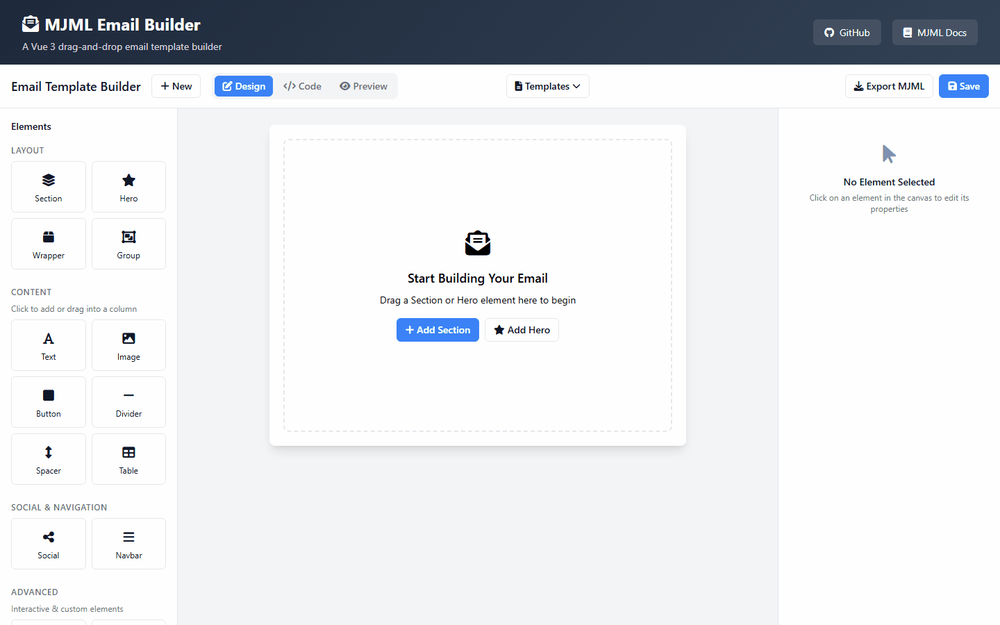

# MJML Email Builder

A Vue 3 drag-and-drop email builder component powered by [MJML](https://mjml.io/). Create responsive, professional email templates with an intuitive visual editor.



## Features

- **Drag & Drop Interface** - Easily build emails by dragging components onto the canvas
- **MJML Powered** - Generates clean, responsive MJML code that works across all email clients
- **Full Component Library** - Includes all standard MJML components:
  - Layout: Section, Column, Group, Hero, Wrapper
  - Content: Text, Image, Button, Divider, Spacer, Table, Raw HTML
  - Social: Social Icons, Navbar
  - Advanced: Accordion, Carousel
- **Live Preview** - See your email rendered in real-time
- **Code Editor** - View and edit the generated MJML source directly
- **Template Library** - Start from pre-built templates or create from scratch
- **TypeScript Support** - Fully typed for excellent developer experience

## Installation

```bash
npm install mjml-email-builder
```

## Usage

### Basic Usage

```vue
<script setup lang="ts">
import { EmailBuilder } from 'mjml-email-builder';
import 'mjml-email-builder/style.css';

const handleSave = (mjml: string) => {
  console.log('MJML output:', mjml);
  // Send to your backend or MJML API for HTML conversion
};
</script>

<template>
  <EmailBuilder @save="handleSave" />
</template>
```

### Using the Composable

```vue
<script setup lang="ts">
import { useEmailBuilder } from 'mjml-email-builder';

const emailBuilder = useEmailBuilder();

// Access template data
console.log(emailBuilder.template.value);

// Generate MJML
const mjml = emailBuilder.generateMjml();

// Import existing MJML
emailBuilder.importMjml('<mjml>...</mjml>');

// Clear template
emailBuilder.clearTemplate();
</script>
```

### Individual Components

You can also import individual components for custom implementations:

```vue
<script setup lang="ts">
import {
  EmailCanvas,
  EmailSection,
  EmailColumn,
  EmailContentElement,
  ElementToolbar,
  PropertyPanel,
  MjmlPreview
} from 'mjml-email-builder';
</script>
```

## Props

### EmailBuilder

| Prop | Type | Description |
|------|------|-------------|
| `initialTemplate` | `string` | Optional initial MJML template to load |

### Events

| Event | Payload | Description |
|-------|---------|-------------|
| `save` | `string` | Emitted when user clicks save, contains MJML output |
| `change` | `string` | Emitted on any template change, contains MJML output |

## Exported Types

```typescript
import type {
  EmailElement,
  EmailElementType,
  EmailTemplate,
  DragItem,
  ElementConfig,
  AttributeConfig
} from 'mjml-email-builder';
```

## Supported MJML Components

### Layout Components
- `mj-section` - Row structure for email layout
- `mj-column` - Responsive container for content
- `mj-group` - Prevents columns from stacking on mobile
- `mj-hero` - Hero section with background image support
- `mj-wrapper` - Wraps multiple sections with shared styling

### Content Components
- `mj-text` - Text content with HTML support
- `mj-image` - Responsive images
- `mj-button` - Clickable buttons
- `mj-divider` - Horizontal dividers
- `mj-spacer` - Vertical spacing
- `mj-table` - Data tables
- `mj-raw` - Raw HTML content

### Social Components
- `mj-social` - Social media icon groups
- `mj-social-element` - Individual social icons
- `mj-navbar` - Navigation menus
- `mj-navbar-link` - Navigation links

### Advanced Components
- `mj-accordion` - Collapsible content sections
- `mj-accordion-element` - Individual accordion items
- `mj-carousel` - Image carousels
- `mj-carousel-image` - Carousel slides

## Converting MJML to HTML

The builder outputs MJML markup. To convert to HTML for sending emails, use the MJML API or library:

```javascript
import mjml2html from 'mjml';

const mjmlCode = emailBuilder.generateMjml();
const { html, errors } = mjml2html(mjmlCode);

if (errors.length === 0) {
  // Use html for sending
}
```

## Styling

The component uses CSS variables for theming. Override these in your app:

```css
:root {
  --background: #ffffff;
  --foreground: #0f172a;
  --card: #ffffff;
  --card-foreground: #0f172a;
  --muted: #f1f5f9;
  --muted-foreground: #64748b;
  --border: #e2e8f0;
  --primary: #3b82f6;
  --primary-foreground: #ffffff;
}
```

## Requirements

- Vue 3.3+
- Modern browser with ES2020 support

## License

MIT License - see [LICENSE](LICENSE) for details.

## Contributing

Contributions are welcome! Please open an issue or submit a pull request.

## Links

- [MJML Documentation](https://documentation.mjml.io/)
- [Vue 3 Documentation](https://vuejs.org/)
